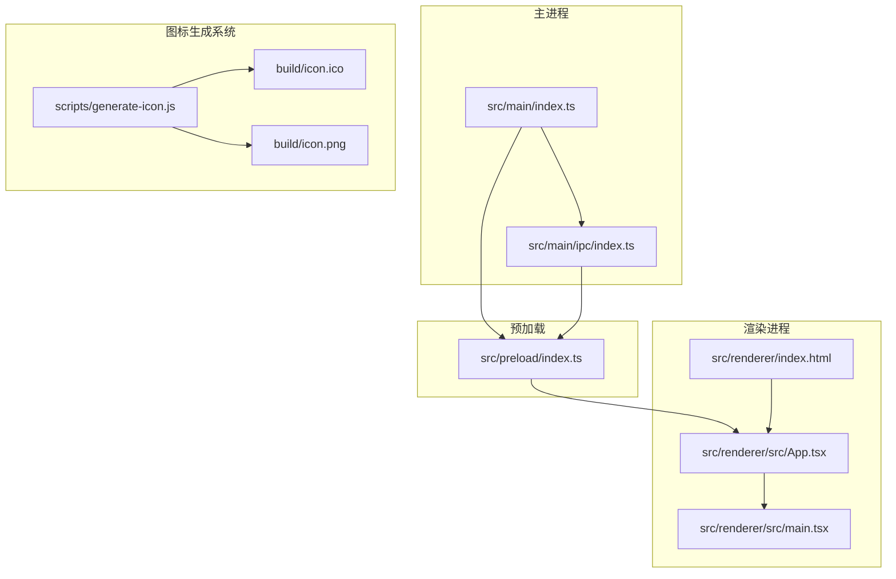
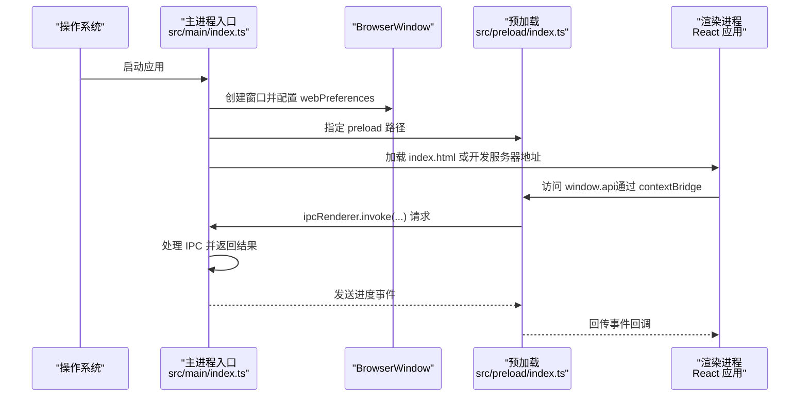
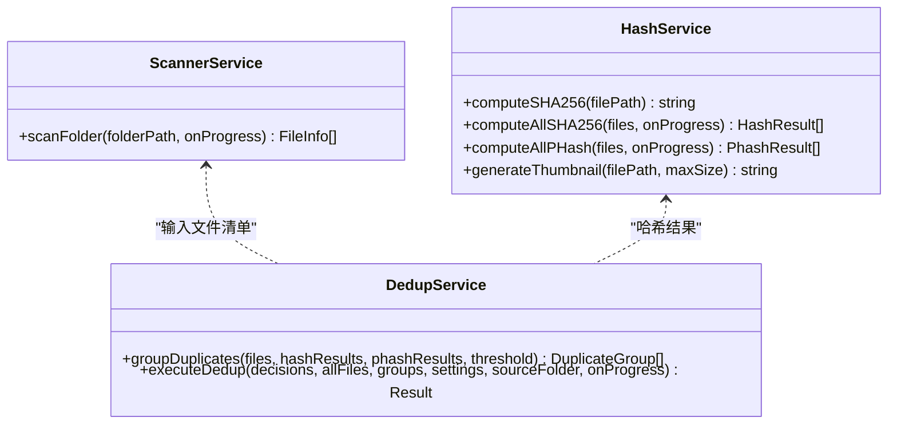

# 配置与部署

<cite>
**本文档引用的文件**
- [electron.vite.config.ts](file://electron.vite.config.ts)
- [package.json](file://package.json)
- [tsconfig.json](file://tsconfig.json)
- [tsconfig.node.json](file://tsconfig.node.json)
- [tsconfig.web.json](file://tsconfig.web.json)
- [postcss.config.js](file://postcss.config.js)
- [tailwind.config.js](file://tailwind.config.js)
- [scripts/generate-icon.js](file://scripts/generate-icon.js)
- [scripts/clean-dist.js](file://scripts/clean-dist.js)
- [src/main/index.ts](file://src/main/index.ts)
- [src/preload/index.ts](file://src/preload/index.ts)
- [src/main/ipc/index.ts](file://src/main/ipc/index.ts)
- [src/main/services/scanner.service.ts](file://src/main/services/scanner.service.ts)
- [src/main/services/hash.service.ts](file://src/main/services/hash.service.ts)
- [src/main/services/dedup.service.ts](file://src/main/services/dedup.service.ts)
</cite>

## 更新摘要
**所做更改**
- 新增图标生成系统章节，详细介绍 generate-icon.js 脚本的功能和使用方法
- 更新版本管理信息，从 2.0.0 升级到 2.0.1
- 添加图标生成流程和多分辨率图标文件说明
- 更新 Electron Builder 配置中的图标路径说明

## 目录
1. [简介](#简介)
2. [项目结构](#项目结构)
3. [核心组件](#核心组件)
4. [架构总览](#架构总览)
5. [详细组件分析](#详细组件分析)
6. [图标生成系统](#图标生成系统)
7. [依赖分析](#依赖分析)
8. [性能考虑](#性能考虑)
9. [故障排查指南](#故障排查指南)
10. [结论](#结论)
11. [附录](#附录)

## 简介
本文件面向红ophoto项目的配置与部署，系统性说明以下内容：
- Vite 构建配置与 Electron-Vite 的三进程（主进程、预加载、渲染进程）分离构建策略
- Electron Builder 配置（含 Windows 安装包 NSIS 选项与图标设置）
- TypeScript 编译配置与开发环境设置
- 生产构建流程（代码压缩、资源优化、依赖打包）
- 跨平台部署指南（Windows、macOS、Linux）
- 图标生成系统（自动生成多分辨率图标文件）
- 性能优化与内存使用监控建议
- 持续集成与自动化部署最佳实践

**更新** 版本已从 2.0.0 升级到 2.0.1，包含图标生成系统的新增功能。

## 项目结构
项目采用 Electron-Vite 提供的三进程分层架构：
- 主进程：负责应用生命周期、窗口管理、系统级能力与 IPC 注册
- 预加载：通过 contextBridge 暴露受控 API 至渲染进程
- 渲染进程：React 应用，负责 UI 与交互



**图表来源**
- [src/main/index.ts:1-61](file://src/main/index.ts#L1-L61)
- [src/preload/index.ts:1-123](file://src/preload/index.ts#L1-L123)
- [src/main/ipc/index.ts:1-156](file://src/main/ipc/index.ts#L1-L156)
- [scripts/generate-icon.js:1-75](file://scripts/generate-icon.js#L1-L75)

**章节来源**
- [electron.vite.config.ts:1-26](file://electron.vite.config.ts#L1-L26)
- [package.json:1-50](file://package.json#L1-L50)

## 核心组件
- Vite/Electron-Vite 配置：定义三进程别名、插件与解析路径
- TypeScript 多配置：分别针对 Node 与 Web 环境，启用复合编译与路径映射
- Tailwind/CSS 工具链：PostCSS 自动前缀与 Tailwind 内容扫描
- Electron Builder：应用元信息、目标平台与 NSIS 安装器配置
- **新增** 图标生成系统：自动生成多分辨率图标文件

**章节来源**
- [electron.vite.config.ts:1-26](file://electron.vite.config.ts#L1-L26)
- [tsconfig.json:1-8](file://tsconfig.json#L1-L8)
- [tsconfig.node.json:1-21](file://tsconfig.node.json#L1-L21)
- [tsconfig.web.json:1-22](file://tsconfig.web.json#L1-L22)
- [postcss.config.js:1-7](file://postcss.config.js#L1-L7)
- [tailwind.config.js:1-24](file://tailwind.config.js#L1-L24)
- [package.json:35-49](file://package.json#L35-L49)

## 架构总览
下图展示从启动到渲染的关键调用链，以及 IPC 在主进程与渲染进程之间的数据流。



**图表来源**
- [src/main/index.ts:1-61](file://src/main/index.ts#L1-L61)
- [src/preload/index.ts:1-123](file://src/preload/index.ts#L1-L123)
- [src/main/ipc/index.ts:1-156](file://src/main/ipc/index.ts#L1-L156)

## 详细组件分析

### Vite 构建配置与三进程分离
- 主进程（main）
  - 使用外部化依赖插件，避免将 Node 侧依赖打入渲染产物
  - 别名 @main 指向 src/main，便于模块导入
- 预加载（preload）
  - 同样使用外部化依赖插件，确保仅暴露受控 API
- 渲染进程（renderer）
  - 使用 React 插件，启用 JSX 与 ESNext 模块
  - 别名 @renderer 指向 src/renderer/src

**章节来源**
- [electron.vite.config.ts:5-24](file://electron.vite.config.ts#L5-L24)

### TypeScript 编译配置
- 根配置（tsconfig.json）
  - 通过 references 引入 node 与 web 两套配置，实现复合编译
- Node 配置（tsconfig.node.json）
  - 模块：ESNext；解析：Node；包含主进程与预加载源码及配置文件
  - 路径映射：@main/* -> ./src/main/*
- Web 配置（tsconfig.web.json）
  - 模块：ESNext；解析：Bundler；启用 JSX；包含渲染源码与类型声明
  - 路径映射：@renderer/* -> ./src/renderer/src/*

**章节来源**
- [tsconfig.json:1-8](file://tsconfig.json#L1-L8)
- [tsconfig.node.json:1-21](file://tsconfig.node.json#L1-L21)
- [tsconfig.web.json:1-22](file://tsconfig.web.json#L1-L22)

### CSS 与样式工具链
- PostCSS
  - 自动添加浏览器前缀，提升兼容性
- Tailwind
  - 内容扫描范围覆盖渲染源码与 HTML 入口
  - 主题扩展了自定义 primary 色彩集

**章节来源**
- [postcss.config.js:1-7](file://postcss.config.js#L1-L7)
- [tailwind.config.js:1-24](file://tailwind.config.js#L1-L24)

### Electron 主进程与窗口初始化
- 窗口尺寸、最小尺寸、无边框标题栏与覆盖层样式
- webPreferences 中禁用 Node 集成、启用上下文隔离、指定预加载脚本
- 开发模式下可加载本地开发服务器地址，否则加载打包后的 HTML
- 注册 IPC 处理器

**章节来源**
- [src/main/index.ts:8-46](file://src/main/index.ts#L8-L46)

### 预加载与受控 API 暴露
- 通过 contextBridge 将一组受控方法暴露至渲染进程 window.api
- 包括窗口控制、文件夹选择与扫描、哈希计算、去重、缩略图生成、设置读取与写入、进度监听等
- 所有调用均通过 ipcRenderer.invoke 与主进程通信

**章节来源**
- [src/preload/index.ts:61-122](file://src/preload/index.ts#L61-L122)

### IPC 处理器与业务流程
- 窗口控制：最小化、最大化/还原、关闭
- 文件夹操作：打开对话框选择目录、扫描目录内支持格式图片
- 哈希计算：SHA-256 与 pHash 分批并发计算，并上报进度
- 去重：先按 SHA-256 精确分组，再对非精确组按 pHash 进行相似分组
- 执行去重：删除或复制模式，按决策集合执行
- 缩略图：基于 sharp 生成 JPEG 数据 URL
- 设置：读取与更新应用设置

**章节来源**
- [src/main/ipc/index.ts:22-155](file://src/main/ipc/index.ts#L22-L155)

### 扫描与哈希服务
- 扫描：递归遍历目录，过滤支持的图片扩展名，分两阶段收集路径与统计信息，带进度回调
- 哈希：SHA-256 流式计算；pHash：缩放到 32x32 灰度后进行二维 DCT，提取低频 8x8 区块，生成二进制特征串
- 批处理：SHA-256 批大小 20，pHash 批大小 5，中间让出事件循环以避免阻塞

**章节来源**
- [src/main/services/scanner.service.ts:28-85](file://src/main/services/scanner.service.ts#L28-L85)
- [src/main/services/hash.service.ts:19-159](file://src/main/services/hash.service.ts#L19-L159)

### 去重算法与执行
- 分组：先以 SHA-256 结果聚类形成精确重复组；对非精确组基于 pHash 进行并查集合并，阈值默认 5
- 执行：删除模式直接删除选中文件；复制模式在目标目录重建相对路径结构并复制保留文件

**章节来源**
- [src/main/services/dedup.service.ts:43-130](file://src/main/services/dedup.service.ts#L43-L130)

### 类关系图（代码级）


**图表来源**
- [src/main/services/scanner.service.ts:1-86](file://src/main/services/scanner.service.ts#L1-L86)
- [src/main/services/hash.service.ts:1-180](file://src/main/services/hash.service.ts#L1-L180)
- [src/main/services/dedup.service.ts:1-209](file://src/main/services/dedup.service.ts#L1-L209)

## 图标生成系统

### 自动生成多分辨率图标文件
项目新增了图标生成系统，通过 scripts/generate-icon.js 脚本自动生成适用于不同平台的图标文件：

- **输入源**：icon-source.jpg（位于项目根目录）
- **输出目录**：build/ 目录
- **生成格式**：
  - Windows ICO 格式：包含多个分辨率的图标，用于 Windows 平台
  - macOS/Linux PNG 格式：512x512 PNG 文件，用于 macOS 和 Linux 平台

### 支持的分辨率规格
脚本自动生成以下分辨率的 PNG 图标：
- 16x16
- 32x32  
- 48x48
- 64x64
- 128x128
- 256x256

### ICO 文件生成机制
脚本使用 Sharp 库进行图像处理，并手动构建 ICO 文件格式：

1. **图像处理**：使用 Sharp 对输入图像进行缩放和裁剪
2. **PNG 缓冲区**：为每个分辨率生成 PNG 格式的缓冲区
3. **ICO 结构构建**：
   - ICO 头部（6 字节）
   - 目录项（16 字节 × 分辨率数量）
   - 图像数据（按偏移量排列）
4. **文件输出**：生成 icon.ico 文件到 build/ 目录

### 使用方法
```bash
# 生成所有分辨率的图标文件
node scripts/generate-icon.js
```

### 与 Electron Builder 集成
生成的图标文件被 Electron Builder 自动使用：
- Windows 平台使用 build/icon.ico 作为应用程序图标
- macOS/Linux 平台使用 build/icon.png 作为应用程序图标

**章节来源**
- [scripts/generate-icon.js:1-75](file://scripts/generate-icon.js#L1-L75)
- [package.json:37-48](file://package.json#L37-L48)

## 依赖分析
- 构建与打包
  - electron-vite：三进程构建与开发服务器
  - vite：前端构建基础
  - electron-builder：多平台打包与安装包生成
  - **新增** sharp：图像处理库，用于图标生成
- 运行时
  - electron：运行时框架
  - react/react-dom：UI 框架
  - @electron-toolkit/preload：预加载辅助
  - @electron-toolkit/utils：开发工具
  - electron-store：设置持久化
  - zustand：状态管理（渲染进程）

**章节来源**
- [package.json:13-36](file://package.json#L13-L36)

## 性能考虑
- 批处理与让出事件循环
  - 哈希计算与 pHash 计算采用固定批次大小，完成后让出事件循环，避免主线程阻塞
- 进度上报与 UI 响应
  - 扫描、哈希、去重阶段均上报进度，渲染端可及时反馈
- 图像处理优化
  - pHash 基于 sharp 进行缩放与灰度转换，减少像素数据体积
  - 缩略图生成使用 JPEG 压缩与最大尺寸限制
  - **新增** 图标生成使用 Sharp 进行高效的多分辨率图像处理
- 内存使用监控建议
  - 使用 Electron DevTools 的 Memory 面板定期快照对比
  - 关注大文件列表与哈希结果缓存，必要时在分组后释放中间结果
  - 对长任务拆分为更小批次，避免单次峰值过高

**章节来源**
- [src/main/services/hash.service.ts:36-53](file://src/main/services/hash.service.ts#L36-L53)
- [src/main/services/hash.service.ts:139-156](file://src/main/services/hash.service.ts#L139-L156)
- [src/main/services/scanner.service.ts:78-82](file://src/main/services/scanner.service.ts#L78-L82)
- [scripts/generate-icon.js:16-22](file://scripts/generate-icon.js#L16-L22)

## 故障排查指南
- 开发与预览
  - 开发：使用构建脚本启动开发服务器
  - 预览：本地预览构建产物
- 打包与安装
  - Windows：使用脚本生成 NSIS 安装包，确保图标路径正确
  - 依赖安装：安装后自动执行安装应用依赖步骤
  - **新增** 图标生成：如果图标文件不存在，先运行图标生成脚本
- 常见问题定位
  - 预加载 API 未生效：确认 webPreferences 中 preload 路径与 contextBridge 暴露位置
  - IPC 无响应：检查主进程是否注册对应 handle，渲染端是否使用 invoke
  - 打包后窗口空白：确认主进程加载的是打包后的 HTML 路径或开发服务器变量
  - **新增** 图标显示异常：检查 build/icon.ico 和 build/icon.png 是否存在且格式正确

**章节来源**
- [package.json:6-13](file://package.json#L6-L13)
- [src/main/index.ts:39-43](file://src/main/index.ts#L39-L43)
- [src/preload/index.ts:122-123](file://src/preload/index.ts#L122-L123)
- [scripts/generate-icon.js:10-11](file://scripts/generate-icon.js#L10-L11)

## 结论
本项目通过 Electron-Vite 实现清晰的三进程分离，结合 TypeScript 复合编译与 Tailwind 工具链，提供了良好的开发体验与可维护性。**最新版本 2.0.1** 包含了新的图标生成系统，能够自动生成多分辨率图标文件，支持 Windows、macOS 和 Linux 平台。生产构建由 Electron Builder 统一管理，Windows 平台采用便携式安装器并支持自定义图标。配合批处理与进度上报机制，可在大数据量场景下保持较好的交互与性能表现。

## 附录

### 生产构建流程（概要）
- 代码压缩与资源优化
  - 使用 Vite 默认压缩策略（Rollup），在生产构建中启用代码压缩与资源内联/外链优化
  - Tailwind 与 PostCSS 在构建时进行样式提取与前缀补齐
- 依赖打包
  - 主进程与预加载使用外部化依赖插件，避免将 Node 依赖打入渲染产物
  - Electron Builder 将渲染产物与主进程产物整合为安装包
  - **新增** 图标生成：构建前自动生成多分辨率图标文件
- 输出与验证
  - 产物输出目录由构建配置统一管理，建议在 CI 中缓存依赖并校验产物完整性

**章节来源**
- [electron.vite.config.ts:7-15](file://electron.vite.config.ts#L7-L15)
- [postcss.config.js:1-7](file://postcss.config.js#L1-L7)
- [tailwind.config.js:3-3](file://tailwind.config.js#L3-L3)
- [scripts/generate-icon.js:64-71](file://scripts/generate-icon.js#L64-L71)

### 跨平台部署指南
- Windows
  - 目标：便携式安装器，支持自定义图标
  - 安装行为：便携式部署，无需管理员权限
  - 图标：使用自动生成的 icon.ico 文件
- macOS/Linux
  - 可通过 Electron Builder 配置扩展目标（如 dmg、AppImage、deb/rpm），并在 CI 中按平台条件构建
  - 注意平台差异的权限与沙箱策略
  - **新增** 图标：使用自动生成的 icon.png 文件

**章节来源**
- [package.json:37-48](file://package.json#L37-L48)

### 持续集成与自动化部署（建议）
- 触发条件
  - 推送至主分支或发布标签时触发构建
- 步骤建议
  - 安装依赖与安装应用依赖
  - 运行构建脚本生成三进程产物
  - **新增** 运行图标生成脚本生成多分辨率图标文件
  - Electron Builder 生成各平台安装包
  - 上传制品至发布页面或包仓库
- 缓存策略
  - 缓存 Node 模块与 Electron Builder 缓存目录，缩短构建时间

**章节来源**
- [package.json:6-13](file://package.json#L6-L13)
- [scripts/generate-icon.js:9-22](file://scripts/generate-icon.js#L9-L22)

### 图标生成脚本详解

#### 脚本功能概述
generate-icon.js 脚本实现了完整的图标生成工作流：

1. **输入验证**：检查输入图像文件是否存在
2. **目录准备**：确保输出目录存在
3. **多分辨率处理**：为每个指定尺寸生成 PNG 图像
4. **ICO 文件构建**：手动构建符合 ICO 格式的文件
5. **PNG 文件生成**：生成 512x512 PNG 文件用于非 Windows 平台

#### 关键特性
- **自动缩放**：使用 Sharp 进行高质量的图像缩放
- **格式兼容**：支持 Windows ICO 和 macOS/Linux PNG 格式
- **批量处理**：一次运行生成所有必需的图标尺寸
- **错误处理**：包含完整的错误处理和日志输出

#### 使用示例
```bash
# 生成所有图标文件
node scripts/generate-icon.js

# 输出示例：
# Generated 16x16 PNG (1234 bytes)
# Generated 32x32 PNG (2345 bytes)
# ...
# ICO file created: build/icon.ico (123.4 KB)
# PNG 512x512 created: build/icon.png
```

**章节来源**
- [scripts/generate-icon.js:1-75](file://scripts/generate-icon.js#L1-L75)