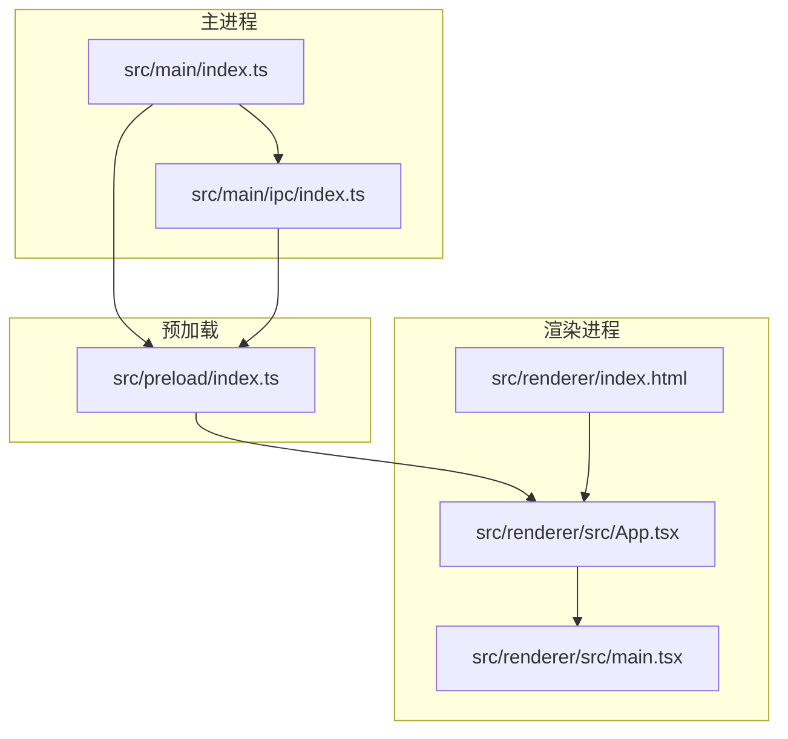
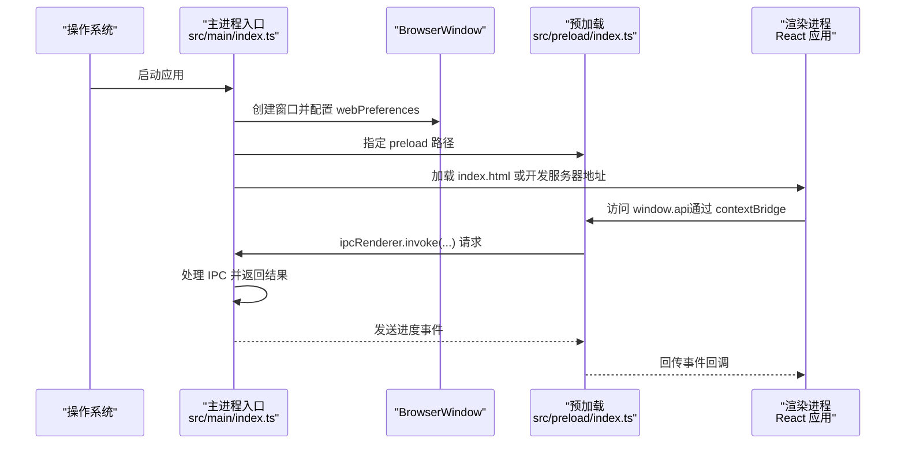
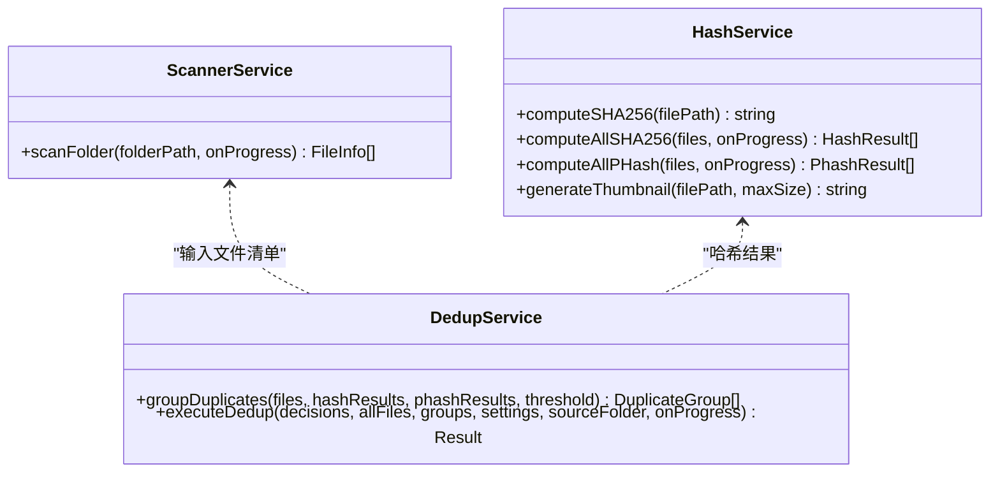

# 配置与部署

<cite>
**本文引用的文件**
- [electron.vite.config.ts](file://electron.vite.config.ts)
- [package.json](file://package.json)
- [tsconfig.json](file://tsconfig.json)
- [tsconfig.node.json](file://tsconfig.node.json)
- [tsconfig.web.json](file://tsconfig.web.json)
- [postcss.config.js](file://postcss.config.js)
- [tailwind.config.js](file://tailwind.config.js)
- [src/main/index.ts](file://src/main/index.ts)
- [src/preload/index.ts](file://src/preload/index.ts)
- [src/main/ipc/index.ts](file://src/main/ipc/index.ts)
- [src/main/services/scanner.service.ts](file://src/main/services/scanner.service.ts)
- [src/main/services/hash.service.ts](file://src/main/services/hash.service.ts)
- [src/main/services/dedup.service.ts](file://src/main/services/dedup.service.ts)
</cite>

## 目录
1. [简介](#简介)
2. [项目结构](#项目结构)
3. [核心组件](#核心组件)
4. [架构总览](#架构总览)
5. [详细组件分析](#详细组件分析)
6. [依赖分析](#依赖分析)
7. [性能考虑](#性能考虑)
8. [故障排查指南](#故障排查指南)
9. [结论](#结论)
10. [附录](#附录)

## 简介
本文件面向红ophoto项目的配置与部署，系统性说明以下内容：
- Vite 构建配置与 Electron-Vite 的三进程（主进程、预加载、渲染进程）分离构建策略
- Electron Builder 配置（含 Windows 安装包 NSIS 选项与图标设置）
- TypeScript 编译配置与开发环境设置
- 生产构建流程（代码压缩、资源优化、依赖打包）
- 跨平台部署指南（Windows、macOS、Linux）
- 性能优化与内存使用监控建议
- 持续集成与自动化部署最佳实践

## 项目结构
项目采用 Electron-Vite 提供的三进程分层架构：
- 主进程：负责应用生命周期、窗口管理、系统级能力与 IPC 注册
- 预加载：通过 contextBridge 暴露受控 API 至渲染进程
- 渲染进程：React 应用，负责 UI 与交互

图表来源
- [src/main/index.ts:1-61](file://src/main/index.ts#L1-L61)
- [src/preload/index.ts:1-123](file://src/preload/index.ts#L1-L123)
- [src/main/ipc/index.ts:1-156](file://src/main/ipc/index.ts#L1-L156)

章节来源
- [electron.vite.config.ts:1-26](file://electron.vite.config.ts#L1-L26)
- [package.json:1-51](file://package.json#L1-L51)

## 核心组件
- Vite/Electron-Vite 配置：定义三进程别名、插件与解析路径
- TypeScript 多配置：分别针对 Node 与 Web 环境，启用复合编译与路径映射
- Tailwind/CSS 工具链：PostCSS 自动前缀与 Tailwind 内容扫描
- Electron Builder：应用元信息、目标平台与 NSIS 安装器配置

章节来源
- [electron.vite.config.ts:1-26](file://electron.vite.config.ts#L1-L26)
- [tsconfig.json:1-8](file://tsconfig.json#L1-L8)
- [tsconfig.node.json:1-21](file://tsconfig.node.json#L1-L21)
- [tsconfig.web.json:1-22](file://tsconfig.web.json#L1-L22)
- [postcss.config.js:1-7](file://postcss.config.js#L1-L7)
- [tailwind.config.js:1-24](file://tailwind.config.js#L1-L24)
- [package.json:35-49](file://package.json#L35-L49)

## 架构总览
下图展示从启动到渲染的关键调用链，以及 IPC 在主进程与渲染进程之间的数据流。

图表来源
- [src/main/index.ts:1-61](file://src/main/index.ts#L1-L61)
- [src/preload/index.ts:1-123](file://src/preload/index.ts#L1-L123)
- [src/main/ipc/index.ts:1-156](file://src/main/ipc/index.ts#L1-L156)

## 详细组件分析

### Vite 构建配置与三进程分离
- 主进程（main）
  - 使用外部化依赖插件，避免将 Node 侧依赖打入渲染产物
  - 别名 @main 指向 src/main，便于模块导入
- 预加载（preload）
  - 同样使用外部化依赖插件，确保仅暴露受控 API
- 渲染进程（renderer）
  - 使用 React 插件，启用 JSX 与 ESNext 模块
  - 别名 @renderer 指向 src/renderer/src

章节来源
- [electron.vite.config.ts:5-24](file://electron.vite.config.ts#L5-L24)

### TypeScript 编译配置
- 根配置（tsconfig.json）
  - 通过 references 引入 node 与 web 两套配置，实现复合编译
- Node 配置（tsconfig.node.json）
  - 模块：ESNext；解析：Node；包含主进程与预加载源码及配置文件
  - 路径映射：@main/* -> ./src/main/*
- Web 配置（tsconfig.web.json）
  - 模块：ESNext；解析：Bundler；启用 JSX；包含渲染源码与类型声明
  - 路径映射：@renderer/* -> ./src/renderer/src/*

章节来源
- [tsconfig.json:1-8](file://tsconfig.json#L1-L8)
- [tsconfig.node.json:1-21](file://tsconfig.node.json#L1-L21)
- [tsconfig.web.json:1-22](file://tsconfig.web.json#L1-L22)

### CSS 与样式工具链
- PostCSS
  - 自动添加浏览器前缀，提升兼容性
- Tailwind
  - 内容扫描范围覆盖渲染源码与 HTML 入口
  - 主题扩展了自定义 primary 色彩集

章节来源
- [postcss.config.js:1-7](file://postcss.config.js#L1-L7)
- [tailwind.config.js:1-24](file://tailwind.config.js#L1-L24)

### Electron 主进程与窗口初始化
- 窗口尺寸、最小尺寸、无边框标题栏与覆盖层样式
- webPreferences 中禁用 Node 集成、启用上下文隔离、指定预加载脚本
- 开发模式下可加载本地开发服务器地址，否则加载打包后的 HTML
- 注册 IPC 处理器

章节来源
- [src/main/index.ts:8-46](file://src/main/index.ts#L8-L46)

### 预加载与受控 API 暴露
- 通过 contextBridge 将一组受控方法暴露至渲染进程 window.api
- 包括窗口控制、文件夹选择与扫描、哈希计算、去重、缩略图生成、设置读取与写入、进度监听等
- 所有调用均通过 ipcRenderer.invoke 与主进程通信

章节来源
- [src/preload/index.ts:61-122](file://src/preload/index.ts#L61-L122)

### IPC 处理器与业务流程
- 窗口控制：最小化、最大化/还原、关闭
- 文件夹操作：打开对话框选择目录、扫描目录内支持格式图片
- 哈希计算：SHA-256 与 pHash 分批并发计算，并上报进度
- 去重：先按 SHA-256 精确分组，再对非精确组按 pHash 进行相似分组
- 执行去重：删除或复制模式，按决策集合执行
- 缩略图：基于 sharp 生成 JPEG 数据 URL
- 设置：读取与更新应用设置

章节来源
- [src/main/ipc/index.ts:22-155](file://src/main/ipc/index.ts#L22-L155)

### 扫描与哈希服务
- 扫描：递归遍历目录，过滤支持的图片扩展名，分两阶段收集路径与统计信息，带进度回调
- 哈希：SHA-256 流式计算；pHash：缩放到 32x32 灰度后进行二维 DCT，提取低频 8x8 区块，生成二进制特征串
- 批处理：SHA-256 批大小 20，pHash 批大小 5，中间让出事件循环以避免阻塞

章节来源
- [src/main/services/scanner.service.ts:28-85](file://src/main/services/scanner.service.ts#L28-L85)
- [src/main/services/hash.service.ts:19-159](file://src/main/services/hash.service.ts#L19-L159)

### 去重算法与执行
- 分组：先以 SHA-256 结果聚类形成精确重复组；对非精确组基于 pHash 进行并查集合并，阈值默认 5
- 执行：删除模式直接删除选中文件；复制模式在目标目录重建相对路径结构并复制保留文件

章节来源
- [src/main/services/dedup.service.ts:43-130](file://src/main/services/dedup.service.ts#L43-L130)

### 类关系图（代码级）

图表来源
- [src/main/services/scanner.service.ts:1-86](file://src/main/services/scanner.service.ts#L1-L86)
- [src/main/services/hash.service.ts:1-180](file://src/main/services/hash.service.ts#L1-L180)
- [src/main/services/dedup.service.ts:1-209](file://src/main/services/dedup.service.ts#L1-L209)

## 依赖分析
- 构建与打包
  - electron-vite：三进程构建与开发服务器
  - vite：前端构建基础
  - electron-builder：多平台打包与安装包生成
- 运行时
  - electron：运行时框架
  - react/react-dom：UI 框架
  - @electron-toolkit/preload：预加载辅助
  - @electron-toolkit/utils：开发工具
  - electron-store：设置持久化
  - sharp：图像处理（哈希与缩略图）
  - zustand：状态管理（渲染进程）

章节来源
- [package.json:13-34](file://package.json#L13-L34)

## 性能考虑
- 批处理与让出事件循环
  - 哈希计算与 pHash 计算采用固定批次大小，完成后让出事件循环，避免主线程阻塞
- 进度上报与 UI 响应
  - 扫描、哈希、去重阶段均上报进度，渲染端可及时反馈
- 图像处理优化
  - pHash 基于 sharp 进行缩放与灰度转换，减少像素数据体积
  - 缩略图生成使用 JPEG 压缩与最大尺寸限制
- 内存使用监控建议
  - 使用 Electron DevTools 的 Memory 面板定期快照对比
  - 关注大文件列表与哈希结果缓存，必要时在分组后释放中间结果
  - 对长任务拆分为更小批次，避免单次峰值过高

章节来源
- [src/main/services/hash.service.ts:36-53](file://src/main/services/hash.service.ts#L36-L53)
- [src/main/services/hash.service.ts:139-156](file://src/main/services/hash.service.ts#L139-L156)
- [src/main/services/scanner.service.ts:78-82](file://src/main/services/scanner.service.ts#L78-L82)

## 故障排查指南
- 开发与预览
  - 开发：使用构建脚本启动开发服务器
  - 预览：本地预览构建产物
- 打包与安装
  - Windows：使用脚本生成 NSIS 安装包，确保图标路径正确
  - 依赖安装：安装后自动执行安装应用依赖步骤
- 常见问题定位
  - 预加载 API 未生效：确认 webPreferences 中 preload 路径与 contextBridge 暴露位置
  - IPC 无响应：检查主进程是否注册对应 handle，渲染端是否使用 invoke
  - 打包后窗口空白：确认主进程加载的是打包后的 HTML 路径或开发服务器变量

章节来源
- [package.json:6-12](file://package.json#L6-L12)
- [src/main/index.ts:39-43](file://src/main/index.ts#L39-L43)
- [src/preload/index.ts:122-123](file://src/preload/index.ts#L122-L123)

## 结论
本项目通过 Electron-Vite 实现清晰的三进程分离，结合 TypeScript 复合编译与 Tailwind 工具链，提供了良好的开发体验与可维护性。生产构建由 Electron Builder 统一管理，Windows 平台采用 NSIS 安装器并支持自定义图标。配合批处理与进度上报机制，可在大数据量场景下保持较好的交互与性能表现。

## 附录

### 生产构建流程（概要）
- 代码压缩与资源优化
  - 使用 Vite 默认压缩策略（Rollup），在生产构建中启用代码压缩与资源内联/外链优化
  - Tailwind 与 PostCSS 在构建时进行样式提取与前缀补齐
- 依赖打包
  - 主进程与预加载使用外部化依赖插件，避免将 Node 依赖打入渲染产物
  - Electron Builder 将渲染产物与主进程产物整合为安装包
- 输出与验证
  - 产物输出目录由构建配置统一管理，建议在 CI 中缓存依赖并校验产物完整性

章节来源
- [electron.vite.config.ts:7-15](file://electron.vite.config.ts#L7-L15)
- [postcss.config.js:1-7](file://postcss.config.js#L1-L7)
- [tailwind.config.js:3-3](file://tailwind.config.js#L3-L3)

### 跨平台部署指南
- Windows
  - 目标：NSIS 安装器，支持自定义图标
  - 安装行为：允许选择安装目录，一键安装关闭
- macOS/Linux
  - 可通过 Electron Builder 配置扩展目标（如 dmg、AppImage、deb/rpm），并在 CI 中按平台条件构建
  - 注意平台差异的权限与沙箱策略

章节来源
- [package.json:35-49](file://package.json#L35-L49)

### 持续集成与自动化部署（建议）
- 触发条件
  - 推送至主分支或发布标签时触发构建
- 步骤建议
  - 安装依赖与安装应用依赖
  - 运行构建脚本生成三进程产物
  - Electron Builder 生成各平台安装包
  - 上传制品至发布页面或包仓库
- 缓存策略
  - 缓存 Node 模块与 Electron Builder 缓存目录，缩短构建时间

章节来源
- [package.json:6-12](file://package.json#L6-L12)