# 项目概述

<cite>
**本文档引用的文件**
- [package.json](file://package.json)
- [electron.vite.config.ts](file://electron.vite.config.ts)
- [src/main/index.ts](file://src/main/index.ts)
- [src/main/ipc/index.ts](file://src/main/ipc/index.ts)
- [src/main/services/scanner.service.ts](file://src/main/services/scanner.service.ts)
- [src/main/services/hash.service.ts](file://src/main/services/hash.service.ts)
- [src/main/services/dedup.service.ts](file://src/main/services/dedup.service.ts)
- [src/main/services/settings.service.ts](file://src/main/services/settings.service.ts)
- [src/preload/index.ts](file://src/preload/index.ts)
- [src/renderer/src/App.tsx](file://src/renderer/src/App.tsx)
- [src/renderer/src/components/ImportStep.tsx](file://src/renderer/src/components/ImportStep.tsx)
- [src/renderer/src/components/CompareStep.tsx](file://src/renderer/src/components/CompareStep.tsx)
- [src/renderer/src/components/ExecuteStep.tsx](file://src/renderer/src/components/ExecuteStep.tsx)
- [src/renderer/src/stores/scanStore.ts](file://src/renderer/src/stores/scanStore.ts)
- [src/renderer/src/types/index.ts](file://src/renderer/src/types/index.ts)
</cite>

## 目录
1. [引言](#引言)
2. [项目结构](#项目结构)
3. [核心组件](#核心组件)
4. [架构概览](#架构概览)
5. [详细组件分析](#详细组件分析)
6. [依赖关系分析](#依赖关系分析)
7. [性能考虑](#性能考虑)
8. [故障排除指南](#故障排除指南)
9. [结论](#结论)
10. [附录](#附录)

## 引言

Redophoto是一个基于Electron的桌面照片去重应用程序，专为帮助用户识别和清理重复的照片文件而设计。该应用通过智能算法和直观的用户界面，让用户能够轻松管理庞大的照片收藏。

### 核心价值与目标

Redophoto的核心价值在于提供一个**高效、可靠且用户友好的照片去重解决方案**。其独特优势包括：

- **双重检测机制**：结合精确的SHA-256哈希和感知哈希(pHash)，既能检测完全相同的文件，也能识别高度相似但略有差异的照片
- **智能分组算法**：使用并查集(Union-Find)数据结构进行高效的重复文件分组
- **灵活的处理选项**：支持直接删除或复制到新文件夹两种处理模式
- **渐进式工作流**：从文件扫描到最终执行的完整流程，每一步都有详细的进度反馈
- **高性能处理**：采用批处理和异步操作，确保大容量照片库的流畅处理

### 技术栈选择理念

项目采用了现代桌面应用开发的最佳实践：

- **Electron + React**：提供跨平台桌面应用开发能力
- **TypeScript**：增强代码质量和开发体验
- **Zustand**：轻量级状态管理，避免过度工程化
- **Sharp**：高性能图像处理库，用于哈希计算和缩略图生成
- **TailwindCSS**：实用优先的CSS框架，快速构建现代化UI

## 项目结构

项目采用典型的Electron + React架构，分为三个主要部分：

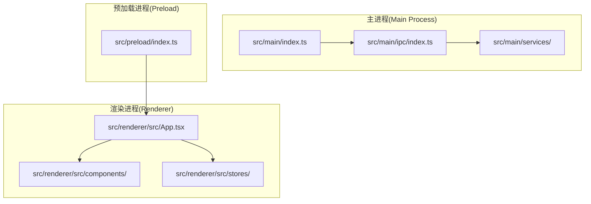

**图表来源**
- [src/main/index.ts:1-61](file://src/main/index.ts#L1-L61)
- [src/preload/index.ts:1-123](file://src/preload/index.ts#L1-L123)
- [src/renderer/src/App.tsx:1-35](file://src/renderer/src/App.tsx#L1-L35)

### 文件组织原则

- **按职责分离**：主进程负责系统集成，渲染进程负责用户界面
- **服务层抽象**：核心业务逻辑封装在独立的服务模块中
- **类型安全**：使用TypeScript接口确保组件间通信的类型安全
- **状态管理**：采用轻量级的状态管理模式，避免复杂的状态管理库

**章节来源**
- [package.json:1-51](file://package.json#L1-L51)
- [electron.vite.config.ts:1-26](file://electron.vite.config.ts#L1-L26)

## 核心组件

### 主要功能特性

Redophoto实现了完整的照片去重工作流程，包含以下核心功能：

1. **文件扫描**：递归遍历指定目录，识别支持格式的照片文件
2. **哈希计算**：生成SHA-256和pHash双重指纹
3. **智能分组**：基于哈希值自动分组重复文件
4. **用户交互**：直观的界面让用户选择保留哪些文件
5. **批量执行**：支持删除或复制到新文件夹两种处理方式

### 数据流架构

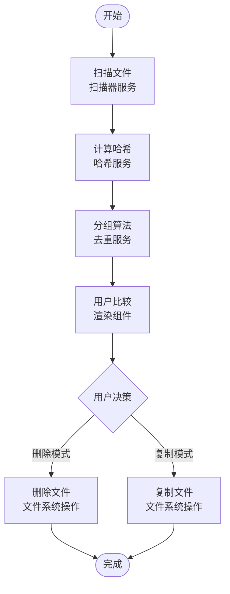

**图表来源**
- [src/main/services/scanner.service.ts:28-86](file://src/main/services/scanner.service.ts#L28-L86)
- [src/main/services/hash.service.ts:29-180](file://src/main/services/hash.service.ts#L29-L180)
- [src/main/services/dedup.service.ts:43-209](file://src/main/services/dedup.service.ts#L43-L209)

**章节来源**
- [src/main/services/scanner.service.ts:1-86](file://src/main/services/scanner.service.ts#L1-L86)
- [src/main/services/hash.service.ts:1-180](file://src/main/services/hash.service.ts#L1-L180)
- [src/main/services/dedup.service.ts:1-209](file://src/main/services/dedup.service.ts#L1-L209)

## 架构概览

### 整体架构设计

Redophoto采用了分层架构，确保各组件职责明确且松耦合：

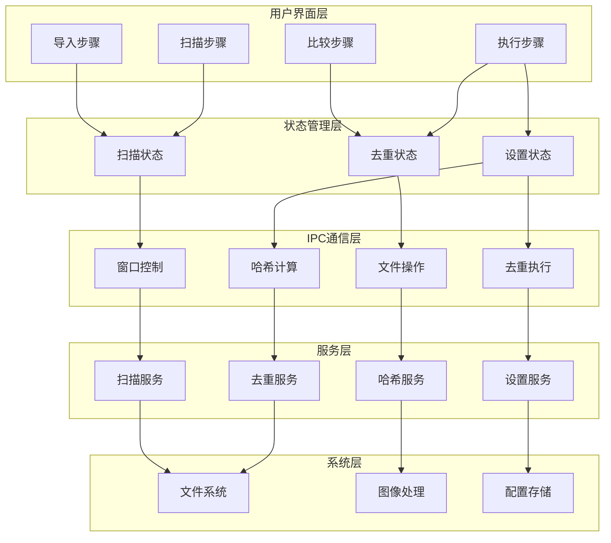

**图表来源**
- [src/renderer/src/App.tsx:11-35](file://src/renderer/src/App.tsx#L11-L35)
- [src/main/ipc/index.ts:22-156](file://src/main/ipc/index.ts#L22-L156)
- [src/main/services/settings.service.ts:17-34](file://src/main/services/settings.service.ts#L17-L34)

### 组件交互序列

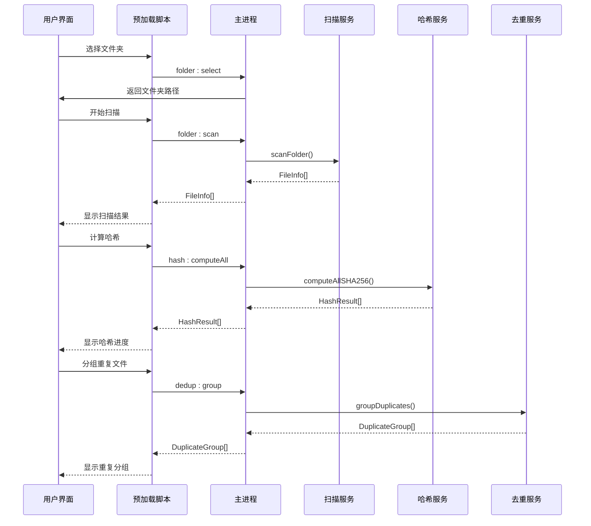

**图表来源**
- [src/preload/index.ts:61-120](file://src/preload/index.ts#L61-L120)
- [src/main/ipc/index.ts:42-107](file://src/main/ipc/index.ts#L42-L107)
- [src/main/services/scanner.service.ts:28-86](file://src/main/services/scanner.service.ts#L28-L86)

**章节来源**
- [src/main/ipc/index.ts:1-156](file://src/main/ipc/index.ts#L1-L156)
- [src/preload/index.ts:1-123](file://src/preload/index.ts#L1-L123)

## 详细组件分析

### 扫描服务 (Scanner Service)

扫描服务负责递归遍历指定目录，识别支持格式的照片文件：

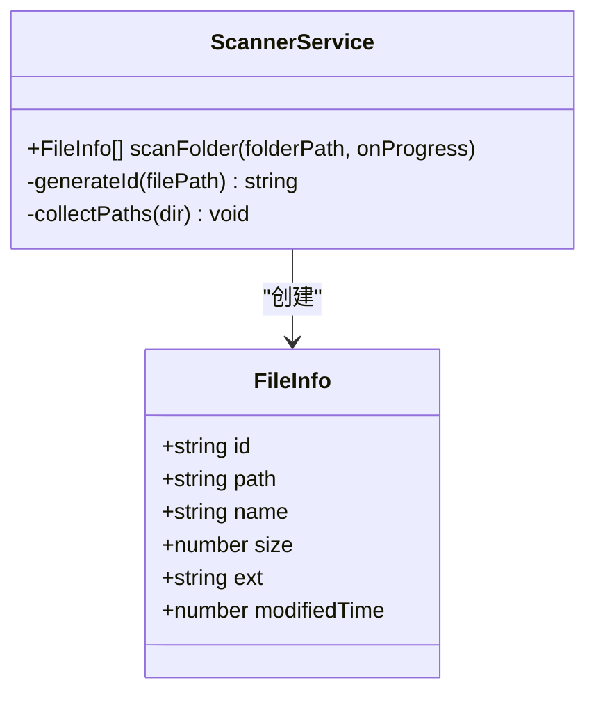

**图表来源**
- [src/main/services/scanner.service.ts:8-86](file://src/main/services/scanner.service.ts#L8-L86)

扫描过程采用两阶段策略：
1. **第一阶段**：收集所有文件路径，跳过不支持的格式
2. **第二阶段**：对每个文件执行文件系统查询，获取元数据信息

**章节来源**
- [src/main/services/scanner.service.ts:28-86](file://src/main/services/scanner.service.ts#L28-L86)

### 哈希服务 (Hash Service)

哈希服务提供双重哈希计算能力：

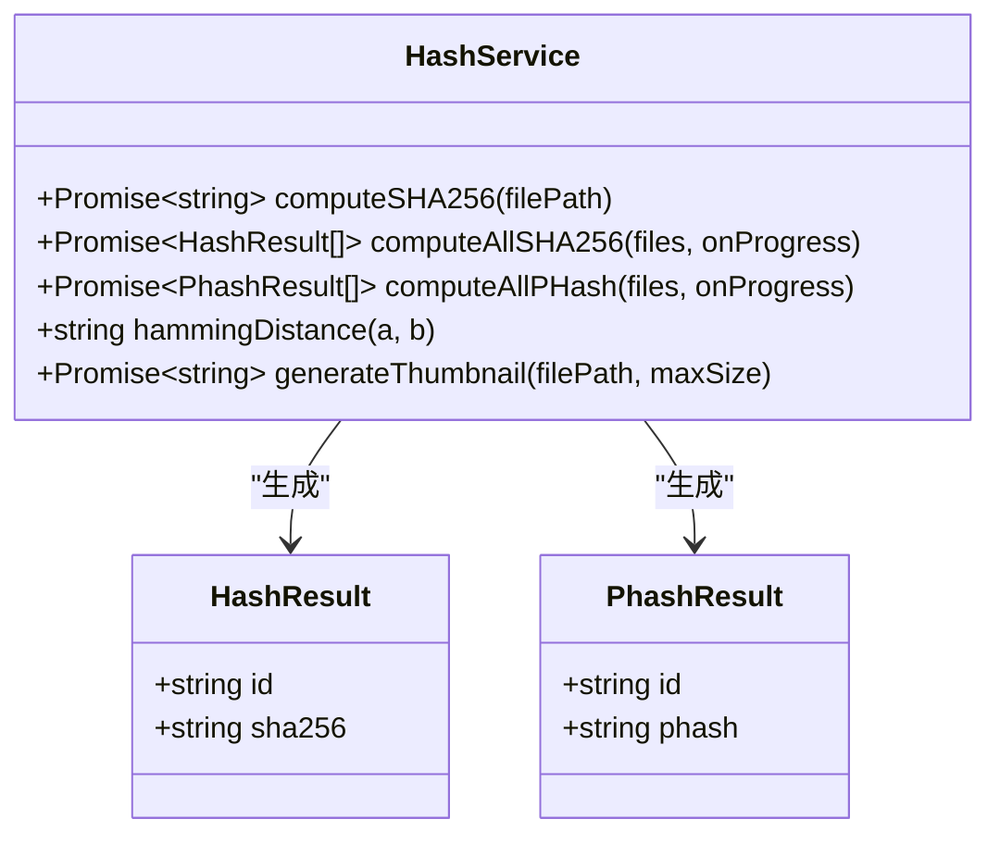

**图表来源**
- [src/main/services/hash.service.ts:6-180](file://src/main/services/hash.service.ts#L6-L180)

#### SHA-256哈希计算

使用流式读取方式计算文件的SHA-256哈希，支持大文件处理：

- **批处理机制**：每次处理20个文件，避免内存峰值
- **错误处理**：单个文件计算失败不影响整体流程
- **进度反馈**：实时更新计算进度

#### 感知哈希(pHash)计算

实现基于DCT的图像感知哈希算法：

- **图像预处理**：调整为32x32像素灰度图
- **DCT变换**：计算二维离散余弦变换
- **特征提取**：取8x8低频区域的均值比较
- **哈希生成**：基于阈值比较生成64位二进制字符串

**章节来源**
- [src/main/services/hash.service.ts:19-180](file://src/main/services/hash.service.ts#L19-L180)

### 去重服务 (Dedup Service)

去重服务是整个应用的核心算法模块：

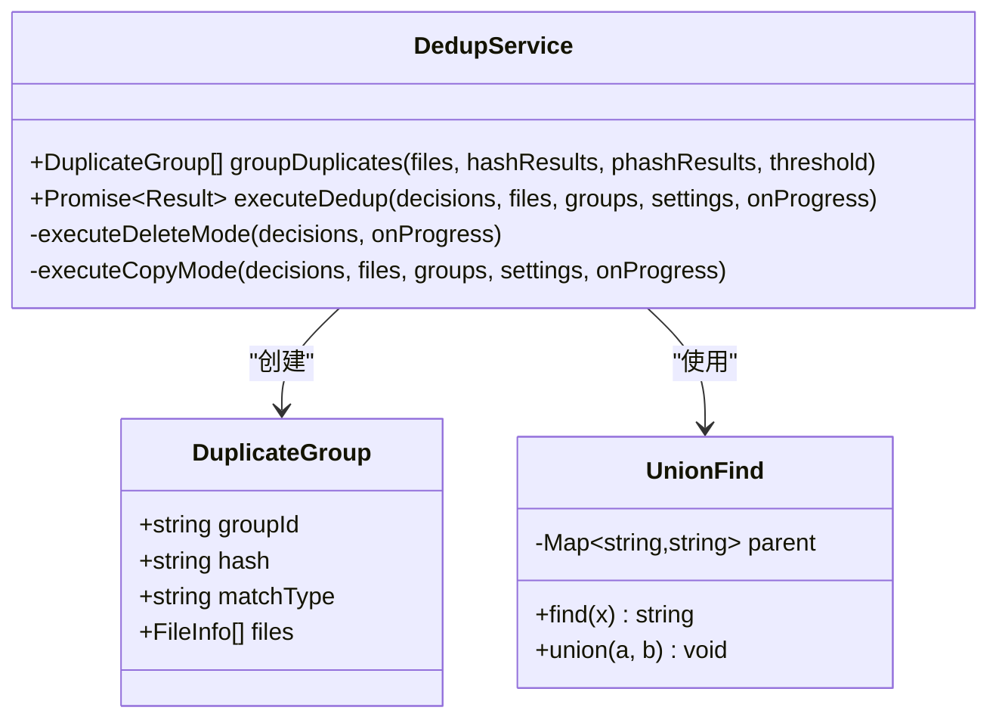

**图表来源**
- [src/main/services/dedup.service.ts:7-209](file://src/main/services/dedup.service.ts#L7-L209)

#### 重复检测算法

采用分层检测策略：

1. **精确匹配阶段**：使用SHA-256哈希进行完全相同的文件识别
2. **相似检测阶段**：对非精确匹配的文件使用pHash进行相似度分析
3. **智能分组**：使用并查集算法将相似文件自动分组

#### 并查集算法实现

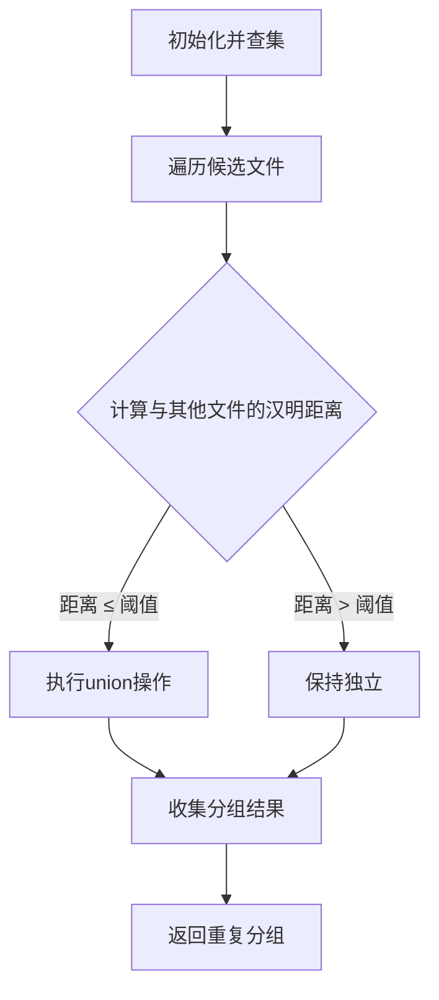

**图表来源**
- [src/main/services/dedup.service.ts:25-115](file://src/main/services/dedup.service.ts#L25-L115)

**章节来源**
- [src/main/services/dedup.service.ts:43-209](file://src/main/services/dedup.service.ts#L43-L209)

### 设置服务 (Settings Service)

设置服务提供应用配置的持久化存储：

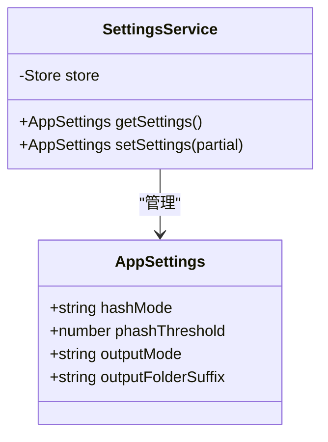

**图表来源**
- [src/main/services/settings.service.ts:3-34](file://src/main/services/settings.service.ts#L3-L34)

默认设置配置：
- **哈希模式**：SHA-256（精确匹配）
- **pHash阈值**：5（相似度阈值）
- **输出模式**：复制（安全模式）
- **输出文件夹后缀**："New"

**章节来源**
- [src/main/services/settings.service.ts:10-34](file://src/main/services/settings.service.ts#L10-L34)

### 用户界面组件

#### 导入步骤 (ImportStep)

导入步骤提供文件夹选择和初始扫描功能：

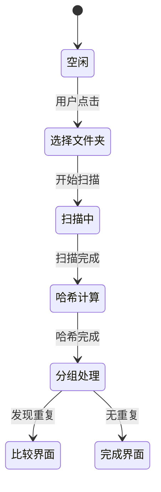

**图表来源**
- [src/renderer/src/components/ImportStep.tsx:10-82](file://src/renderer/src/components/ImportStep.tsx#L10-L82)

#### 比较步骤 (CompareStep)

比较步骤允许用户对重复文件进行人工审核：

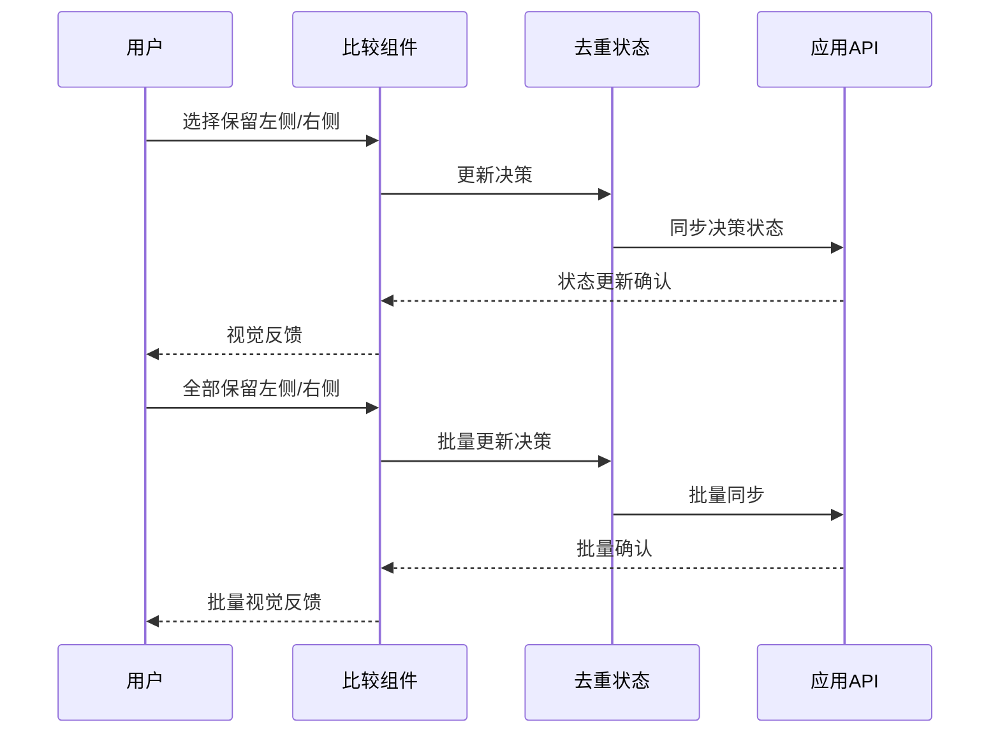

**图表来源**
- [src/renderer/src/components/CompareStep.tsx:110-133](file://src/renderer/src/components/CompareStep.tsx#L110-L133)

#### 执行步骤 (ExecuteStep)

执行步骤展示处理进度和结果：

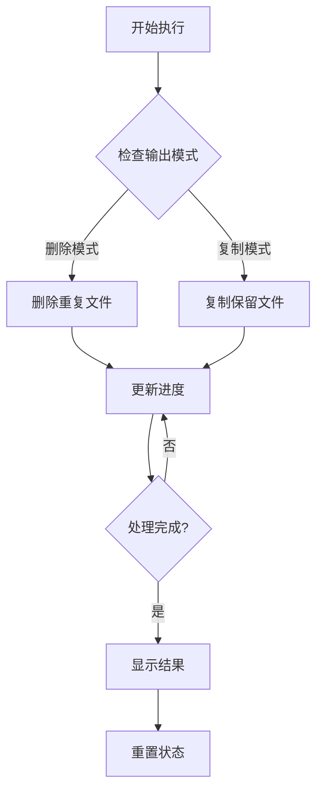

**图表来源**
- [src/renderer/src/components/ExecuteStep.tsx:29-55](file://src/renderer/src/components/ExecuteStep.tsx#L29-L55)

**章节来源**
- [src/renderer/src/components/ImportStep.tsx:1-174](file://src/renderer/src/components/ImportStep.tsx#L1-L174)
- [src/renderer/src/components/CompareStep.tsx:1-279](file://src/renderer/src/components/CompareStep.tsx#L1-L279)
- [src/renderer/src/components/ExecuteStep.tsx:1-161](file://src/renderer/src/components/ExecuteStep.tsx#L1-L161)

## 依赖关系分析

### 外部依赖关系

```mermaid
graph TB
subgraph "运行时依赖"
A[electron-store] --> B[配置持久化]
C[sharp] --> D[图像处理]
E[zustand] --> F[状态管理]
end
subgraph "开发时依赖"
G[electron-vite] --> H[构建工具]
I[react] --> J[UI框架]
K[tailwindcss] --> L[样式框架]
end
subgraph "Electron生态"
M[electron] --> N[桌面环境]
O[@electron-toolkit/*] --> P[工具库]
end
```

**图表来源**
- [package.json:13-34](file://package.json#L13-L34)

### 内部模块依赖

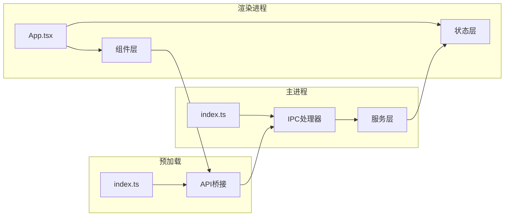

**图表来源**
- [src/renderer/src/App.tsx:1-35](file://src/renderer/src/App.tsx#L1-L35)
- [src/main/index.ts:1-61](file://src/main/index.ts#L1-L61)
- [src/preload/index.ts:1-123](file://src/preload/index.ts#L1-L123)

**章节来源**
- [package.json:1-51](file://package.json#L1-L51)

## 性能考虑

### 并发处理策略

Redophoto采用了多层并发优化：

1. **批处理机制**：哈希计算采用20个文件一批的策略
2. **事件循环让渡**：定期调用`setImmediate()`避免阻塞UI线程
3. **异步文件操作**：所有文件系统操作都使用Promise异步处理
4. **内存管理**：及时释放中间结果，避免内存泄漏

### 内存优化

- **流式哈希计算**：使用流式读取避免大文件占用过多内存
- **渐进式UI更新**：只在必要时更新UI状态，减少重绘开销
- **缓存策略**：扫描结果在内存中缓存，避免重复扫描

### 网络和I/O优化

- **图像处理**：使用Sharp库进行高效的图像处理
- **文件系统访问**：批量文件操作减少系统调用次数
- **进度反馈**：实时进度更新提升用户体验

## 故障排除指南

### 常见问题及解决方案

#### 文件扫描失败

**症状**：扫描过程中出现错误或文件数量异常

**可能原因**：
- 文件权限不足
- 磁盘空间不足
- 文件被其他程序占用

**解决方法**：
1. 检查文件夹访问权限
2. 确认磁盘空间充足
3. 关闭占用文件的程序

#### 哈希计算超时

**症状**：哈希计算长时间无响应

**可能原因**：
- 大文件处理时间过长
- 系统资源不足
- 图像文件损坏

**解决方法**：
1. 分批处理大文件集合
2. 关闭其他占用CPU的应用
3. 检查图像文件完整性

#### 去重执行错误

**症状**：执行去重时出现文件删除/复制失败

**可能原因**：
- 目标文件夹权限不足
- 磁盘空间不足
- 文件名冲突

**解决方法**：
1. 检查目标文件夹写入权限
2. 确认目标位置有足够的磁盘空间
3. 修改输出文件夹名称避免冲突

**章节来源**
- [src/main/services/dedup.service.ts:132-209](file://src/main/services/dedup.service.ts#L132-L209)

## 结论

Redophoto是一个设计精良的照片去重桌面应用，具有以下显著特点：

### 技术优势

- **算法先进性**：结合精确匹配和相似检测的双重哈希策略
- **架构合理性**：清晰的分层架构和职责分离
- **用户体验**：直观的工作流程和实时进度反馈
- **性能表现**：高效的批处理和内存管理策略

### 应用价值

该应用解决了用户在管理大量照片时面临的核心痛点：
- 自动识别重复文件，节省存储空间
- 提供安全的去重方案，避免误删重要文件
- 支持多种处理模式，适应不同使用场景
- 提供透明的操作过程，让用户完全掌控

### 发展前景

Redophoto为照片管理领域提供了一个可靠的解决方案，其模块化的架构也为未来的功能扩展奠定了良好基础。随着AI技术的发展，该应用可以进一步集成更智能的图像识别能力，为用户提供更加精准的去重服务。

## 附录

### 快速开始指南

#### 系统要求

- **操作系统**：Windows 10/11 (64位)
- **内存**：至少4GB RAM
- **存储空间**：至少1GB可用空间
- **权限**：需要对目标文件夹的读取权限

#### 安装步骤

1. **下载安装包**
   - 访问项目发布页面
   - 下载对应版本的安装包

2. **安装应用**
   - 运行安装程序
   - 按照安装向导完成安装
   - 默认安装到`C:\Program Files\ReDoPhoto`

3. **首次启动**
   - 双击桌面图标启动应用
   - 首次运行会自动检查更新

#### 基本使用流程

1. **选择照片文件夹**
   - 点击"选择照片文件夹"按钮
   - 浏览并选择包含照片的文件夹
   - 支持JPG、PNG、GIF、BMP、WebP、TIFF等格式

2. **开始扫描**
   - 点击"开始扫描重复照片"
   - 等待扫描完成（显示进度条）
   - 扫描完成后自动进入哈希计算阶段

3. **查看重复结果**
   - 在比较界面查看发现的重复文件组
   - 使用"保留左侧"或"保留右侧"按钮选择保留文件
   - 可以使用"全部保留左侧/右侧"快速处理

4. **执行去重**
   - 确认所有决策已完成
   - 点击"执行去重"
   - 选择处理模式（删除或复制）
   - 查看执行结果和统计信息

#### 高级设置

- **哈希模式**：可选择精确匹配(SHA-256)、相似检测(pHash)或组合模式
- **相似度阈值**：调整pHash相似度判断标准
- **输出模式**：选择删除原始文件或复制到新文件夹
- **输出文件夹名称**：自定义复制模式下的输出文件夹名称

#### 故障排除

- **应用无响应**：重启应用或检查系统资源
- **扫描速度慢**：关闭其他占用磁盘的应用
- **去重失败**：检查目标文件夹权限和磁盘空间
- **图像预览失败**：检查图像文件是否损坏